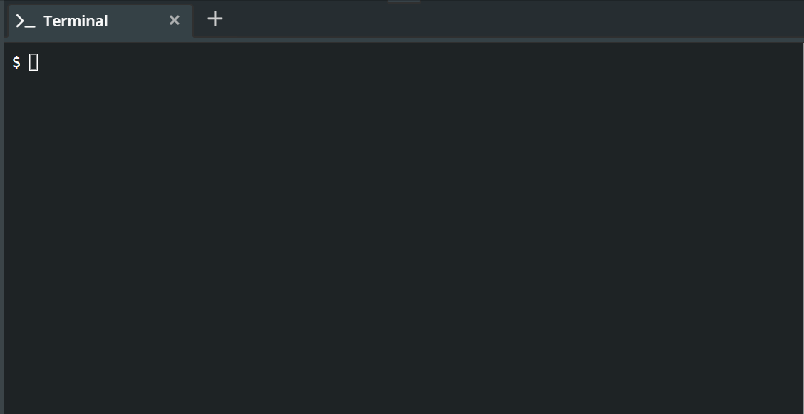

# Die Collatz-Folge

Die [Collatz](https://de.wikipedia.org/wiki/Collatz-Problem)-Folge (auch `3n+1`-Folge genannt), wurde von deutschen Mathematiker Lothat Collatz aufgestellt.

Dabei bildet man die Zahlen der Folge durch folgende Konstruktionsvorschrift:

- Beginne mit irgendeiner natürlichen Zahl `n > 0`.
- Ist `n` gerade, so nimm als nächstes `n/2`.
- Ist `n` ungerade, so nimm als nächstes `3 * n + 1`.
- Wiederhole die Vorgehensweise mit der erhaltenen Zahl, bis die Zahl 1 ist.

## Beispiel

Man startet mit `n = 10`. Da `n` gerade ist, erhält man als nächste 5.
Da 5 ungerade ist, erhält man damit `3 * 5 + 1 = 16`.
Da 16 gerade ist, erhält man 8.
Da 8 gerade ist, erhält man 4.
Da 4 gerade ist, erhält man 2.
Da 2 gerade ist, erhält man 1.

Also ist die Folge
`10 => 5 => 16 => 8 => 4 => 2 =>1`.

## Aufgabe

- Bestimme analog für die Zahl 6 und 13 die zugehörige Folgen.


# Umsetzung mit Python

Um ein Pythonprogramm zu schreiben, welches das Collatz-Problem löst, werden wir schrittweise arbeiten. Dabei erstellen wir zunächst ein Programm, welches ein ähnliches Problem *löst* und modifizeiren dieses so, dass es am Ende das tatsächliche Problem löst. Am Besten speichert man die Zwischenergebnisse mit `git`.


# Halbieren von Zahlen

Zunächst ignorieren wir, dass die Zahlen der Collatz-Folge auch durch die `3 * n +1` vorschrift größer werden können und schreiben ein Programm, welches nur Zahlen halbiert.

1. Dafür schreiben wir zunächst `n = 8` um die Startzahl 8 festzulegen.

1. Da wir abhängig von der Startzahl unterschiedlich viele Schritte bis zum Ende machen, müssen wir eine Wiederholung mit `while`verwenden.

1. Der Konstruktionsvorschrift entnehmen wir, dass wir die Wiederholung abbrechen können, falls wir 1 erreichen.

1. In jedem Schritt der Wiederholung, wird die Zahl, die unter `n`gespeichert ist halbiert.


Das führt uns zu folgendem Programmcode:

```python
n = 8
while n > 1:
    n = n / 2
    print(n)
```

## Aufgabe

- Schreibe den Code in die Datei `collatz.py`.
- Führe das Programm im Terminal aus, indem Du `python collatz.py` schreibst und bestätigst (`ENTER`).
- Notiere die Zahlen, die das Programm ausgibt.
- Was fällt dir bei den ausgegebenen Zahlen auf?
- Änder im Code den Wert von `n` und lasse auch dann das Programm laufen.


# Halbieren von Zahlen II

Du hast sicherlich bemerkt, dass Python bei der Divison durch zwei sofort von ganzzahligen Werten auf Dezimalzahlen gewechselt ist. Dies ist aber schlecht, da *gerade* und *ungerade* Aussagen über ganze Zahlen sind.

Das Problem lässt sich lösen, da Python nicht nur eine Division von Zahlen kennt.
Man man Python auch im sogenannten REPL ausführen. Dies steht für **R**ead-**E**valuate-**P**rint-**L**oop, also einer Wiederholung (Schleife) in der ständig eingelsen wird, was der User eingibt, diese Eingabe ausgewertet wird und schließlich direkt die Antwort ausgegeben wird. Im REPL ist daher auch kein `print` notwendig, um Ergebnisse zu erhalten.

Das folgende GIF zeigt das Vorgehen und wie man mit Python im REPL als Taschenrechner arbeiten kann.



Im letzten Schritt wurde über `**` die Potenz  berechnet. Python zeigt die 27778 Stellen des Ergebnis über viele Zeilen an. Das Ergebnis ist mit  deutlich größer als Zahlen die Dein Taschenrechner darstellen kann (max. )

## Die drei Divisionen

Python kennt die Division 
- mit `/`, also `8 / 2`
- mit `//`, also `9 // 2`
- mit `%`, also `10 % 4`

## Aufgabe

- Starte Python im Terminal als REPL-Sitzung.
- Führe solange Divisionen mit den drei OPeratoren `/`, `//` und `%` aus, bis du verstanden hast, was diese Operatoren machen.
- Es ist notwendig auch Divisionen durchzuführen, die nicht glatt aufgehen, um die Unterschiede zu sehen!



Hoffentlich hast Du herausgefunden, dass die folgenden drei Regeln gelten:

1. Die Division mit `/` gibt *immer* ein Ergebnis mit Nachkommastellen. Dabei versucht Python den dezimalen Wert möglichst genau anzugeben.
    ```python
    >>> 25 / 6
    4.166666666667
    ```

2. Die Division mit `//` gibt *immer* eine ganze Zahl als Ergebnis aus. Diese Zahl entspricht dem Ergebnis einer Division mit Rest (Grundschule). D.h.
    ```python
    >>> 25 // 6
    4
    ```

3. Die Division mit `%` gibt auch immer eine ganze Zahl aus. Das Ergebnis dabei ist aber der Rest, den man erhalten würde, wenn man die Division mit Rest durchführt.

    ```python
    >>> 25 % 6
    1
    ```

## Teilbatkeitsprobleme

Der `%`-Operator ist damit geeignet Fragen der Teilbarkeit zu entscheiden. Falls die Divison ohne Rest aufgeht, weiß man, dass die Division glatt aufgeht und somit die Zahl teilbar ist.

```python
>>> 505844402544 % 117
0
```

D.h. also, dass die Zahl 505844402544
 teilbar durch 117 ist. Die folgenden Rechnungen bestätigen dies.

 ```python
>>> 505844402544 // 117
4323456432
>>> 505844402544 / 117
4323456432.0
```


# Halbieren von Zahlen III

Jetzt können wir unser Programm so verändern, dass statt `n = n / 2` mit `n = n // 2` die Ergebnisse immer ganze Zahlen beleiben. 

## Aufgabe

- Führe diese Änderung durch.
- Vergleiche, was passiert wenn Du die Startzahl 64 und die Startzahl 91 verwendest.


# Fallunterscheidung zwischen geraden und ungeraden Zahlen

Bisher haben wir *immer* die Zahl in jedem Schritt halbiert. Der `%`-Operator gibt uns aber jetzt die Möglichkeit, zwischen geraden und ungeraden Zahlen zu entscheiden.
Mit `n % 2 == 0` können wir überprüfen, ob unsere Zahl ohne Rest durch 2 teilbar ist, also gerade ist.

Statt jetzt *immer* die Zahl zu halbieren, werden wir dies nur noch tun, wenn diese tatsächlich gerade ist.

## Aufgabe
- Ändere Deinen Code so, dass er folgende Verzweigung enthält:

    ```python
    if n % 2 == 0:
        n = n // 2
    else:
        break
    ```

- Starte Dein Programm mit den Startzahlen 64 und 224.

- Stelle eine Vermutung auf, was der Ausdruck `break` bewirkt.


# Vollständiges Programm

Wenn wir jetzt statt `break` den zweiten Konstruktionsschritt für ungerade Zahlen eintragen, vervollständigen wir das Programm.

Dafür müssen wir nur noch `n = 3 * n + 1` im `else`-Teil der Verzweigung eintragen. Diese Rechnung stellt sicher, dass danach immer wieder ein Halbierungsschritt möglich wird, da für jede ungerade Zahl `n` die Zahl `3 * n + 1` gerade ist.

## Aufgabe

- Schreibe das vollständige Programm.
- Lasse das Programm für einige Startzahlen laufen, wo Du bereits die Collatz-Folge kennst.
-  Finde dabei die Startzahl zwischen 5 und 15, für die die längste Zahlenfolge ausgegeben wird.

