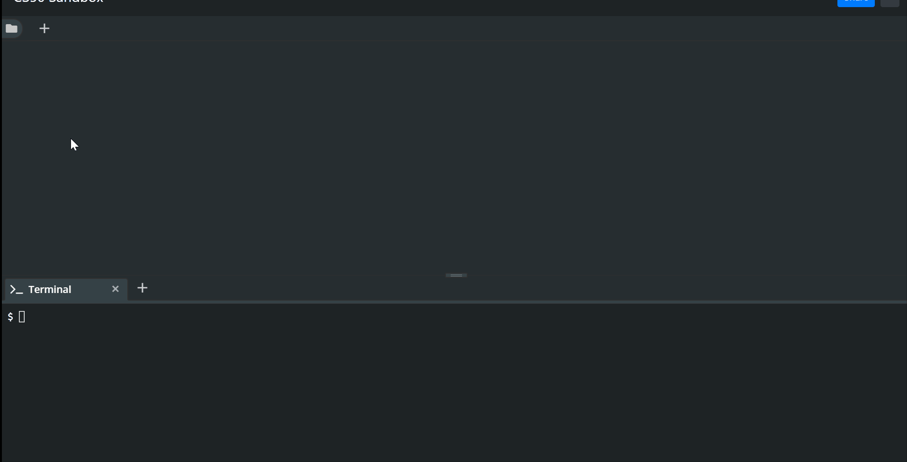

# Arbeiten mit der CS50 Sandbox

Hier lernst Du den Umgang mit der CS50 Sandbox, die wir in Zukunft als Programmierumgebung, die für alle exakt gleich ist, nutzen wollen, damitdie kleinen Unterschiede bei Betriebssystem oder den verwendenten Programmen nicht zu Störungen führen.


# Dateien erstellen und anzeigen

In dieser Umgebung kannst Du Dateien erstellen, indem Du neben dem Ordnersymbol auf das Pluszeichen klickst. Danach wird die Datei direkt auch in einem Fenster geöffnet angezeigt. Klickt man das Ordnersymbol an, so ist es möglich den Verzeichnisbaum anzuzeigen. Auch dort kann man Dateien oder Verzeichnisse anlegen, in dem man die oberste Makierung dafür verwendet.


### Aufgabe

Erstelle einen Ordner `Buch`, der die drei Textdateien `Kapitel1.txt`, `Kapitel2.txt` und `Kapitel3.txt` enthält.


# Dateien ergänzen und anzeigen

Den Inhalt einer Datei kann man im Fenster des Editors ansehen - für jede geöffnete Datei erhält man ein neues Tab. Gleichzeitig erlaubt diese Ansicht auch das Editieren der entsprechenden Datei.


# Die Konsole

Viele Systeme lassen sich nur per Konsole steuern, da auf diese Weise leichter durch Fernzugriff auf z.B. Internetservern o.ä. gearbeitet werden kann. Grundlegende Kenntnisse von Konsoleneanwendungen sind daher oft hilfreich. 

Die verschiedenen Betriebssysteme haben oft leicht unterschiedliche Implementationen ihrer Konsolenanwendung. Hier auf diesem virtualisierten Ubuntu-System lernst Du einiges über die Linux-Konsole. Wenn man z.b. [Cmder](https//:www.cmder.net) verwendet, ist es auch unter Windows möglich die gleichen Befehle zu nutzen - zustätzlich versteht Cmder aber auch Windows eigene Konsolenbefehle.


# `mkdir` -- Verzeichnisse in der Konsole erstellen

Mit dem Befehl `mkdir` (für **m**a**k**e **dir**ectroy) kann man Verzeichnisse erstellen. Dabei erzeugt `mkdir test` einen Ordner mit Namen Test.

## Aufgabe
Erstelle den Ordner `Rezepte` mit Hilfe der Konsole.


# `touch` -- Dateien in der Konsole erstellen

Mit dem Befehl `touch test` kannst Du eine Datei erstellen. Unter Linux ist es nicht notwendig, Dateien eine Dateiendung zu geben. 

## Aufgabe

Erstelle jetzt die Datei `buch.txt`. Wobei die Dateiendung für eine sogenannte Text-Datei steht.


`touch buch.txt`

