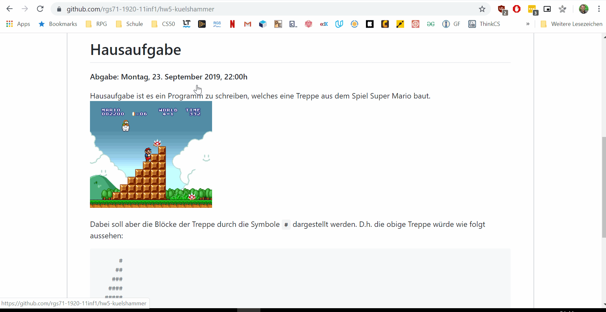
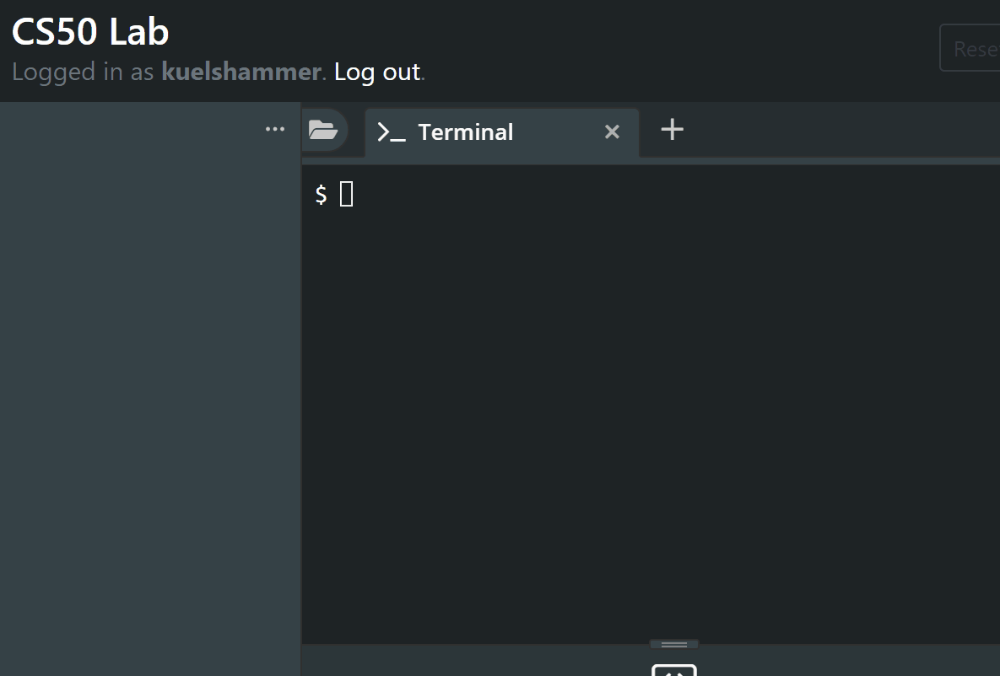
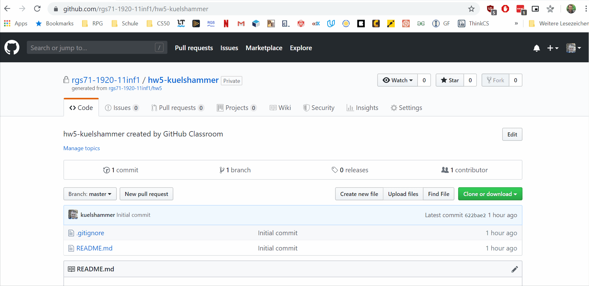

# Super Mario

**Ich arbeite noch am Lab :-(**

## 1. Git verbinden

Du bist diesem Link von der Hausaufgabe in Github gefolgt. 
Gehe nun auf die Seite und kopiere den Link zu diesem Repository, wie in dem folgenden GIF gezeigt.

Danach gehst Du in das Terminal in diesem Lab und klonst das Repository durch den Befehl `git clone <link>`. Das nächste GIF zeigt dieses Vorgehen:


Solltest Du eine Fehlermeldung erhalten, dass die Authentifizierung scheitert, ist es nötig statt mit dem Passwort durch ein [Personal access tokens](https://help.github.com/en/articles/creating-a-personal-access-token-for-the-command-line) erzeugst.

Danach statt mit User/Password mit User/Token anmelden!


