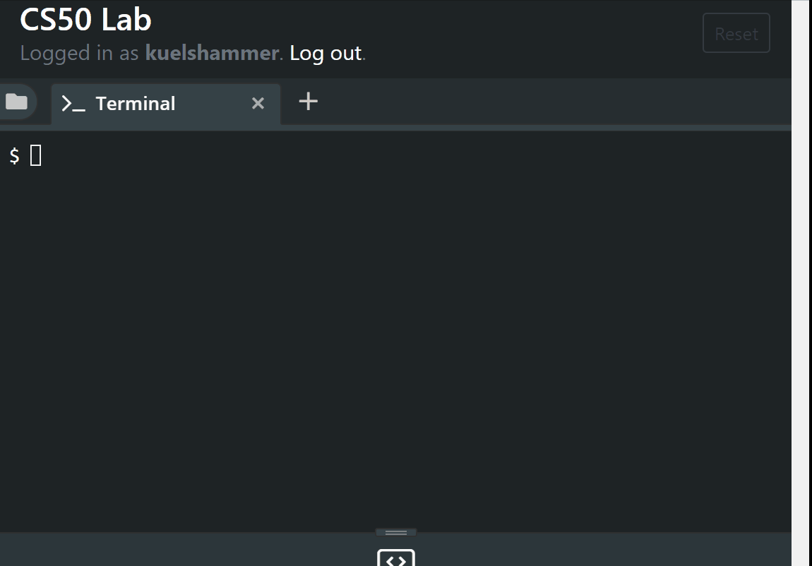

# Super Mario


## Git verbinden

Du bist diesem Link von der Hausaufgabe in Github gefolgt. 
Gehe nun auf die Seite und kopiere den Link zu diesem Repository, wie in dem folgenden GIF gezeigt.


Danach gehst Du in das Terminal in diesem Lab und klonst das Repository durch den Befehl `git clone <link>`. Das nächste GIF zeigt dieses Vorgehen:



Solltest Du eine Fehlermeldung erhalten, dass die Authentifizierung scheitert, ist es nötig statt mit dem Passwort durch ein [Personal access tokens](https://help.github.com/en/articles/creating-a-personal-access-token-for-the-command-line) die Anmeldung durchzuführen. Das GIF zeigt wie man ein solchens Token erzeugt.


Danach statt mit User/Password mit User/Token anmelden!



## Arbeiten mit Strings

In de Informatik werden Zeichenketten als Strings bezeichnet. Im Quellcode der meisten Programmiersprachen werden Strings durch Hochkommata dargestellt. D.h. `103` ist die ganze Zahl 103, aber `"103"` ist die Zeichenfolge, welche die Symbole 1, 0 und 3 enthält.

In einer Python REPL Sitzung kann man entsprechendes sehen:



Einmal wird die Größe `i = 103` als Integer (`int`) , das andere Mal die Größe `s = "103"` als String (`str`).

### Aufgabe

- Öffne selbst eine Python REPL Sitzung.
- Definiere mit `s1 = "103"` und mit `s2 = "69"` zwei Strings, die Du mit den Namen `s1` bzw. `s2` ansprechen kannst.
- Überlege Dir, was Du erwartest, wenn man `s1 + s2` durch Python auswerten lässt. Was passiert tatsächlich? Kannst Du dies erklären?
- Was erwartest Du jetzt, wenn Du `s1 * 5` eingibst? Überprüfe Deine Vermutung!


## Mario - eine erste Version

Wenn man sich die Treppe anschaut, so fällt auf, dass die oberste Stufe 1 Block, die zweite Stufe 2 Blöcke usw. haben. D.h. wir zählen eigentlich nur von 1 bis zu einer vorgegebenen Stufenanzahl.

## Aufgabe
- Erzeuge im Ordner `hw5-<username>`, den Du geklont hast die Datei `mario.py`.
- Ergänze als erstes die Zeile `height = 7` (Beispiel hat eine Höhe von 7 Stufen).
- Schreibe mit Hilfe einer geeigneten `while`-Schleife ein Programm, welches die Zahlen von 1 bis `height` ausgibt.
- Füge durch `git add mario.py` die Datei zu dem nächsten Commit hinzu.
- Durch `git commit -m "<message>"` kannst Du diese jetzt commiten.
- Mit dem Befehl `git push origin master` kannst Du jetzt die neue Datei `mario.py` zu Github pushen.
- Überprüfe in Deinem Repository, dass die neue Datei jetzt vorhanden ist.


## Hashtags statt Zahlen

Bisher gibt unser Programm nur die Anzahl der Blöcke aus, aber nicht die Blöcke selbst. Im Folgenden wollen wir dies ändern, so dass wir folgende Ausgabe erhalten.

```python
#
##
###
####
#####
######
#######
```

### Aufgabe
- Ändere den Schleifenkörper in `mario.py` so ab, dass statt einer Zahl jetzt ein String ausgegeben wird, der entsprechend viele `#` enthält.
- Benutze dafür, was Du unter *Arbeiten mit Strings* gelernt hast.
- Führe entsprechend `add`, `commit` und `push` aus, und überprüfe, dass die Änderungen jetzt im Repository bei Github angezeigt werden.


## Pyramide nach rechts verschieben

Als nächsten Schritt wollen wir die `#`-Blöcke rechtsbündig ausgeben.

```python
......#
.....##
....###
...####
..#####
.######
#######
```

Als erstes fügen wir dafür in den Strings die wir ausgeben entsprechend viele Punkte (`.`) ein, um die Pyramide zu verschieben.

### Aufgabe
- Ändere Deinen Code so ab, dass die neue Ausgabe erzeugt wird.
- Speichere die Änderungen wie oben bei Github ab.



## Leerzeichen statt Punkte

Python kennt auch das Leerzeichen als String. Statt `.` kann man ` ` benutzen, damit man die Hilfspunkte verstecken kann.

```python
      #
     ##
    ###
   ####
  #####
 ######
#######
```

### Aufgabe
- Ändere den Code so, dass die rechtsbündige Pyramide ohne Hilfspunkte erzeugt wird.
- Lade die Änderungen in Dein Repository hoch.


